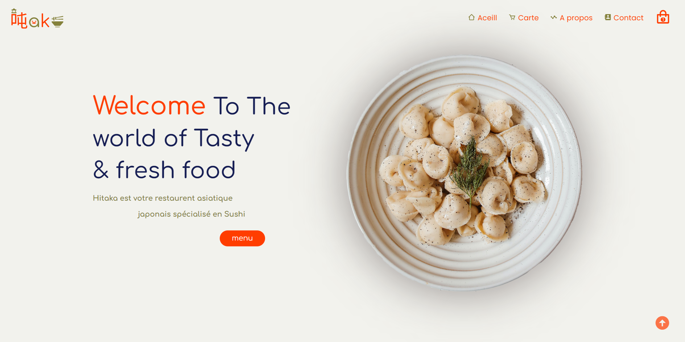
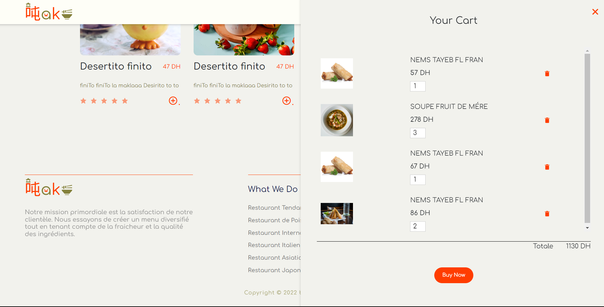
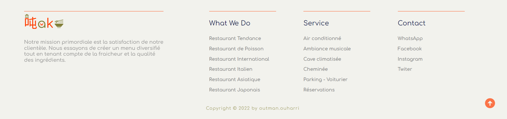
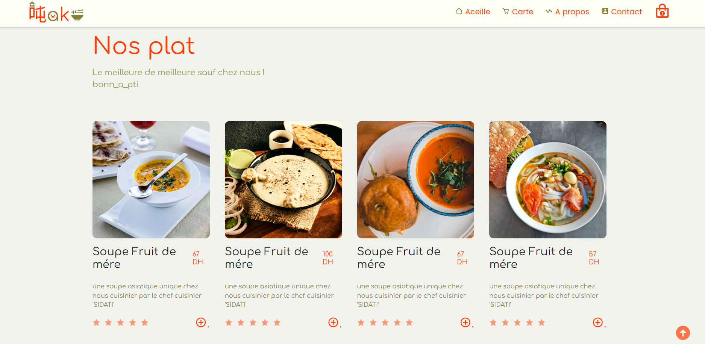
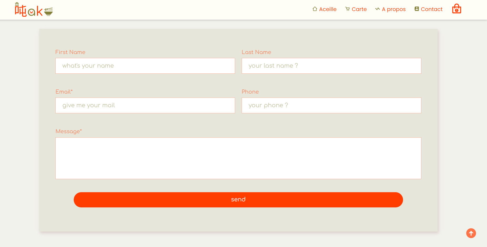

# HITAKA

Context of the project

Your client Hitaka is a Japanese Asian restaurant specializing in Sushi, he wants to strengthen his presence on the market by introducing his new website.

For this the product owner (Trainer) has chosen you to carry out this project, you must design a model of the site. For a first return to the product owner (Trainer), while introducing your skills as a web designer so that you can use the UI/UX concepts for his website.

Then the implementation of this model in a website in HTML5, CSS 3 and Javascript, you are led to perform the following tasks:

​

Modeling part:

​

4-page prototype (Home, Map, About, Contact)

Respect good UX/UI practices and responsive design.

Propose a logo that respects the graphic charter.

​

Web Design part:

​

Home page (representative for the website).

Menu page (includes all the menus offered by the restaurant (Salad, Obento, dishes...)):

A select that allows you to filter by categories.
A button to add the selected choice to the calculation.
A Confirm order button to calculate the sum of the prices of the selected choices, and display a confirmation message which contains the summary of the order.
​

About Page (Contains detailed information about the restaurant and its history).

Contact page (Contains a form that takes [surname, first name, phone number, email, message] and displays a confirmation message with the details filled in).

​

BONUS:

Manage the form fields of the contact page with REGEX (JS).

Save commands with localstorage.
